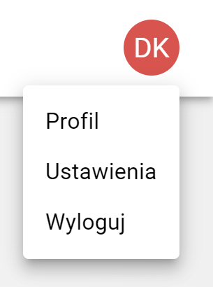

# Podstawy

## Logowanie

Po wejściu na stronę internetową serwisu zobaczymy ekran umożliwiający zalogowanie się do platformy.

Wpisujemy tutaj adres E-mail oraz Hasło do naszego konta.

Po zalogowaniu zostaniemy przeniesieni do pierwszego z widoków.

## Interfejs

### Górne menu

Zawiera dostęp do widoków dostępnych w systemie, takich jak:

* Projekty
* Zadania
* Urządzenia

Po jego **lewej** stronie znajduje się logo serwisu. Po jego kliknięciu przeniesiemy się na stronę, która zawiera komunikat powitalny:

Po jego **prawej** stronie widać awatar aktualnie zalogowanego użytkownika.
Po jego kliknięciu zostanie rozwinięte **menu opcji**.

### Menu opcji

W tym menu są dostępne podstawowe funkcje, takie jak:

#### Profil

Tutaj możemy zobaczyć informacje takie jak:

* Użytkownik (Imię i nazwisko / Nazwa użytkownika)
* E-mail - adres E-mail przypisany do konta
* Rola - nadana rola dla konta

#### Ustawienia

Zawiera sekcje:

* Użytkownicy
* Tagi

##### Użytkownicy

Ekran zawiera **przycisk** umożliwiający dodawanie nowego użytkownika oraz tabelę z dostępnymi użytkownikami w serwisie.

Nad tabelą dostępne jest **pole "Wyszukaj"** umożliwiające wyszukiwanie konkretnego użytkownika.

Po prawej stronie każdego wiersza w tabeli dostępna jest **ikona edycji** konkretnego użytkownika:

Na tym ekranie możemy edytować szczegóły profilu, zmienić **hasło** oraz **usunąć użytkownika**

##### Tagi

Ekran zawiera **przycisk** umożliwiający dodawanie nowego taga oraz tabelę z dostępnymi tagami w serwisie.

Nad tabelą dostępne jest **pole "Wyszukaj"** umożliwiające wyszukiwanie konkretnego taga.

Po prawej stronie każdego wiersza w tabeli dostępna jest **ikona edycji** konkretnego taga: