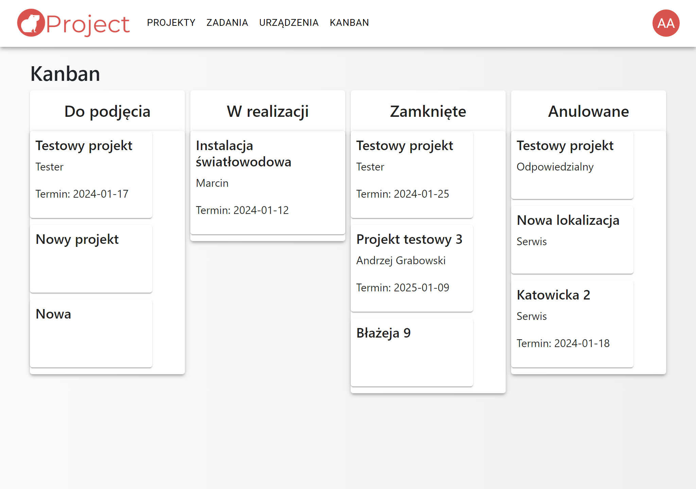
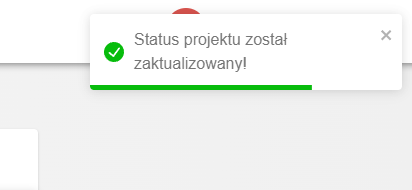
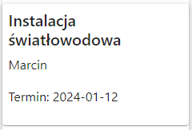

# Kanban

## Widok strony 'Kanban'

## Opis

Widok Kanban skupia się na wizualizacji procesu pracy za pomocą tablicy, na której są umieszczone karty reprezentujące zadania lub zadania do wykonania.

Tablica Kanban składa się z czterech głównych sekcji:

* Do podjęcia
* W realizacji
* Zamknięte
* Anulowane

Karty na tablicy Kanban przechodzą przez te sekcje w miarę postępu pracy. Każda karta reprezentuje pojedyncze zadanie i zawiera informacje na temat tego, co należy zrobić, kto jest odpowiedzialny, oraz inne szczegóły. Dzięki temu, cały zespół może w łatwy sposób śledzić postęp prac i dostosowywać priorytety.

Widok Kanban jest elastyczny i umożliwia dostosowanie tablicy do konkretnych potrzeb zespołu czy projektu. Pomaga w zwiększeniu przejrzystości procesu pracy, minimalizuje opóźnienia, ułatwia zarządzanie zadaniami oraz usprawnia komunikację w zespole.

## Obsługa

* Zmiana statusu projektu

    Wystarczy przeciągnąć 'kafelek' z danym projektem do wybranej przez siebie kolumny.
    O prawidłowym zmianie statusu poinformuje nas komunikat w prawym górnym rogu ekranu:

    

* Szczegóły widoku projektu:

    Aby przejść do widoku szczegółowego danego projektu wystarczy kliknąć dwukrotnie na 'kafelek' z odpowiadającym nam projektem:
    
    