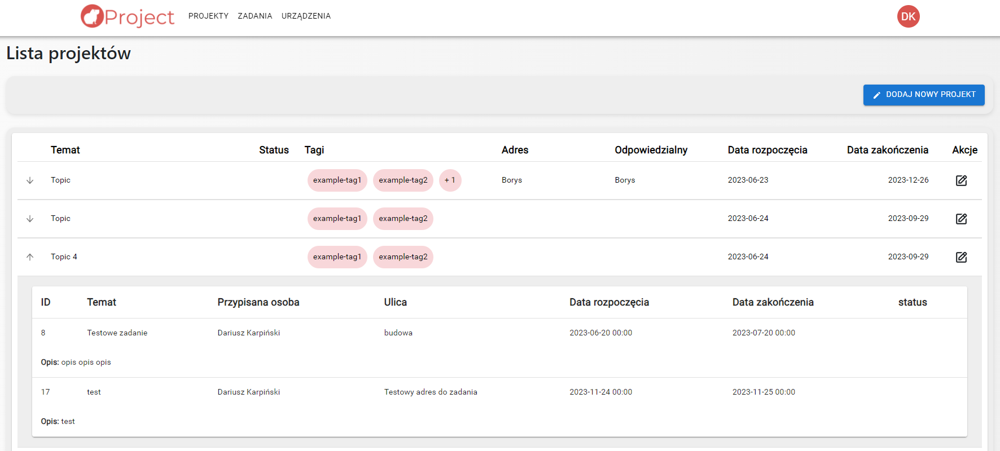

# Projekty

### Widok strony 'Projekty':

### Opis:

Strona zawiera tabelę z listą projektów, a nad nią po prawej stronie widoczny jest przycisk 'Dodaj nowy projekt'.

W tabeli widoczne są kolumny:

* Temat
* Status
* Tagi
* Adres
* Odpowiedzialny
* Data rozpoczęcia
* Data zakończenia
* Akcje

1. Po prawej stronie wiersza jest **przycisk edycji,** dzięki któremu można edytować szczegóły danego projektu.
2. Po lewej stronie wiersza jest **przycisk strzałki**, dzięki której można rozwinąć **podtabelę** z widocznymi zadaniami przypisanymi do danego projektu.

W podtabeli z zadaniami dostępne są kolumny:

* ID
* Temat
* Przypisana osoba
* Ulica
* Data rozpoczęcia
* Data zakończenia
* Status
