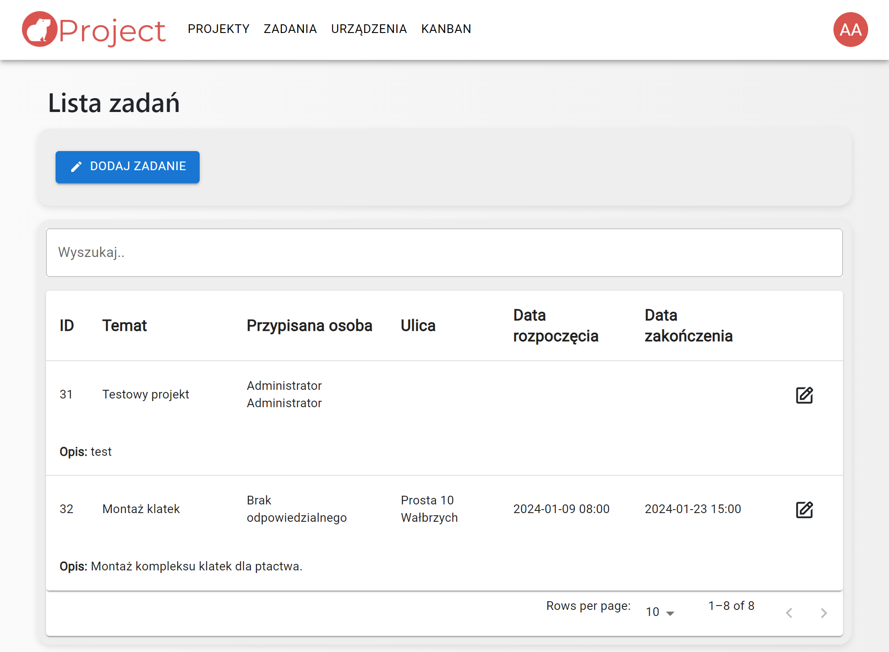
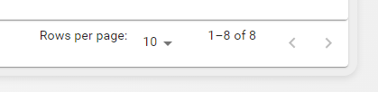
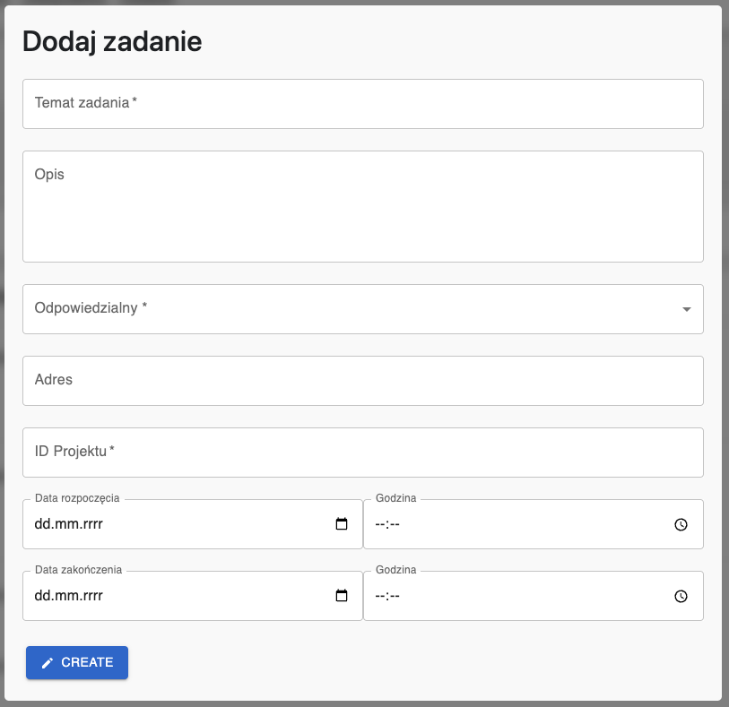
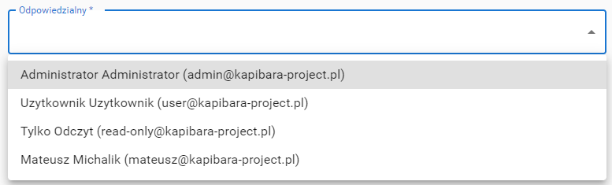
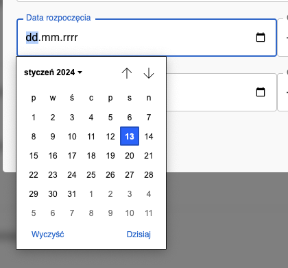
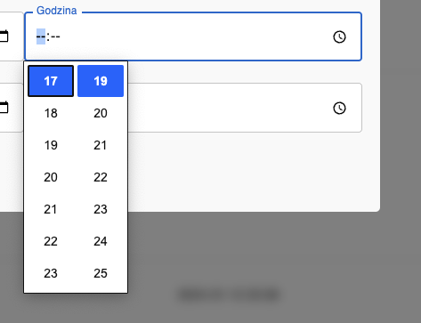
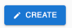

# Zadania

## Opis

Strona zawiera tabelę z listą zadań, a nad nią po prawej stronie widoczny jest przycisk 'Dodaj zadanie'.

W tabeli widoczne są kolumny:

* ID
* Temat
* Przypisana osoba
* Ulica
* Data rozpoczęcia
* Data zakończenia
* Akcje

  Po prawej stronie wiersza jest **przycisk edycji,** dzięki któremu można edytować szczegóły danego zadania.

Na dole tabeli możesz przejść do kolejnej / poprzedniej strony z wynikami, oraz wybrać ile rekordów ma być wyświetlanych na jednej stronie:

## Dodawanie zadania

Widok dodawania nowego zadania:

Tutaj można dodać nowe zadanie.

Pola ze znakiem gwiazdki (*) są wymagane i należy je zawsze uzupełnić.

### Dostępne pola

* Temat zadania - Temat nowego zadania (**WYMAGANE**)
* Opis - Opis nowego zadania
* Odpowiedzialny - Osoba odpowiedzialna za wykonanie danego zadania (**WYMAGANE**)

  

  Wybierz z listy użytkownika, którego chcesz przypisać do zadania
* Adres - Adres lokalizacji dla nowego zadania
* ID Projektu - Podaj ID Projektu do którego ma być przypisane zadanie (**WYMAGANE**)
* Data i godzina rozpoczęcia - Wybierz datę oraz godzinę rozpoczęcia wykonywania danego zadania
* Data i godzina zakończenia - Wybierz datę oraz godzinę zakończenia wykonywania danego zadania
    
    Po prawej stronie pola z datą jest ikona kalendarza. W rozwiniętym komponencie możesz kliknąć na datę, która cię interesuje:

    

    Po prawej stronie pola z godziną jest ikona zegara. W rozwiniętym komponencie możesz kliknąć na godzinę, która cię interesuje:

    

Po wypełnieniu formularza kliknij przycisk: , aby dodać zadanie.